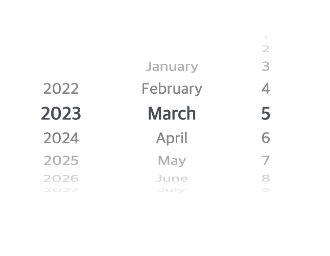

# iOS Style Picker




[Demo](https://ricale.kr/ios-style-picker)

## 1. Install

```
$ yarn add ios-style-picker
```

## 2. Usage

### 2.1. Default

```tsx
import { DatePicker } from 'ios-style-picker';
import 'ios-style-picker/dist/style.css';

function SomeComp(/* ... */) {
  // ...
  return (
    <div>
      {/* ... */}
      <DatePicker
        fromDate={fromDate}
        toDate={toDate}
        initDate={initDate}
        onChange={(y, m, d) => {
          console.log(y, m, d);
        }}
      />
    </div>
  );
}
```

### 2.2. Formatting Values of Pickers

```tsx
import { DatePicker } from 'ios-style-picker';
import 'ios-style-picker/dist/style.css';
import en from 'ios-style-picker/formatters/en';
// import ko from 'ios-style-picker/formatters/ko';
// import ja from 'ios-style-picker/formatters/ja';
// import zh from 'ios-style-picker/formatters/zh';

function SomeComp(/* ... */) {
  // ...
  return (
    <div>
      {/* ... */}
      <DatePicker
        onChange={(y, m, d) => {
          console.log(y, m, d);
        }}
        formatters={en}
      />
      {/* ... */}
      <DatePicker
        onChange={(y, m, d) => {
          console.log(y, m, d);
        }}
        formatters={{
          year: value => `${value}년`,
          month: value => `${value}월`,
          day: value => `${value}일`,
        }}
      />
    </div>
  );
}
```

### 3. Props

```ts
export type DatePickerProps = {
  onChange: (year: number, month: number, day: number) => void;
  fromDate?: Date;
  toDate?: Date;
  initDate?: Date;
  infinite?: boolean;
  className?: string;
};
```

### 4. Class Names

```
div.ios-style-date-picker
  div
    div.ios-style-picker
      ul.ios-style-picker__option-list
        li.ios-style-picker__option-item
      div.ios-style-picker__highlight
        ul.ios-style-picker__highlight-list
          li.ios-style-picker__highlight-item
```

## 5. Reference

It's forked from [this gist](https://gist.github.com/wjpeters/876a8fe4040a2bb4b4eb28d2270620a5)
